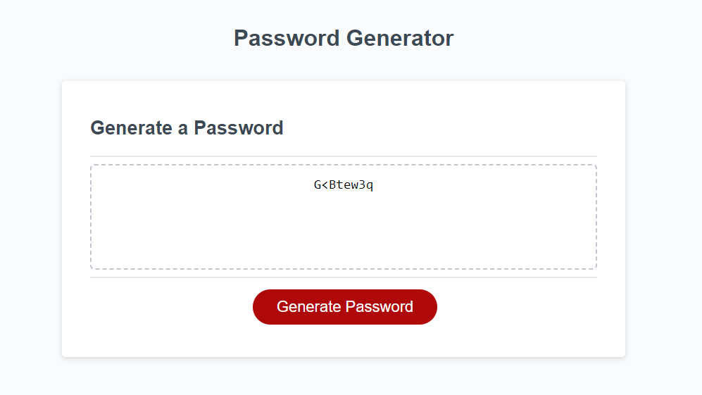

# password_generator

## Webpage that generates passwords

## Description

This webpage creates a unique password for users. The user will select how many characters (between 8-129) for the length of their password. The user will then select the characters to use from the following list:

- lowercase letters
- uppercase letters
- numbers
- symbols

The purpose for this project is to help users select strong passwords that satisfy the password requirements.

The first part of this project was straighforward. The program asks the user for information and makes a password. The second part of this project was a welcomed challenge. After the password was created, I needed to devise a way to make sure it included the appropriate characters. I quickly found out that simply selecting a character type was no guarantee the password would actually contain that type. I created a function to check and regenerate a new password (if needed) until the user selections were satisfied.

I had the logic and understanding of how to make this part happen, however I needed help with flow and syntax. I referenced w3schools and udemy to research calling a function from another function.

